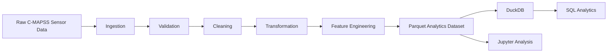

# WearPath

Industrial Sensor Data Pipeline & Predictive Maintenance Analytics

**WearPath** maps the *wear path* of an industrial asset — the measurable trajectory from healthy operation toward end-of-life — using sensor time series, data-quality gates, and remaining useful life (RUL) analytics.

It is a **local, reproducible Python batch data pipeline** built on the NASA C-MAPSS turbofan engine degradation dataset. It demonstrates ingestion, validation, cleaning, time-series feature engineering, Parquet analytical outputs, DuckDB SQL analytics, Jupyter exploration, and automated tests — sized for a Data Engineer Intern portfolio, not a distributed production platform.

## Overview

The project turns raw multivariate sensor trajectories into an analytics-ready dataset and SQL warehouse for RUL-style predictive-maintenance analysis.

## Problem Statement

Industrial assets emit dense sensor streams over operating cycles. Before modeling failure risk, those streams need trustworthy engineering:

- reliable ingestion and schema assignment
- explicit data-quality checks
- deterministic cleaning (no silent zero-imputation)
- per-engine time-series transforms
- SQL analytics that reviewers can read and rerun

WearPath implements that path end-to-end on a well-known public industrial dataset.

## Dataset

**NASA C-MAPSS — Turbofan Engine Degradation Simulation Dataset** (FD001 training split by default).

| Item | Detail |
|---|---|
| Source | NASA Prognostics Center of Excellence / NASA Open Data Portal |
| Portal | https://data.nasa.gov/dataset/cmapss-jet-engine-simulated-data |
| Historical PCoE entry | https://ti.arc.nasa.gov/tech/dash/groups/pcoe/prognostic-data-repository/ |
| Primary files used | `train_FD001.txt` (+ optional `test_FD001.txt`, `RUL_FD001.txt`) |
| Format | Space-separated, no header, 26 columns |

Raw files are **not committed** (see `.gitignore`). Obtain them with:

```bash
python scripts/download_cmapss.py
```

Or place `train_FD001.txt` under `data/raw/CMAPSSData/` manually.

### Schema

| Column | Description |
|---|---|
| `engine_id` | Simulated turbofan unit identifier |
| `cycle` | Operating cycle (time step) within an engine run |
| `op_setting_1..3` | Operating/condition settings |
| `sensor_01..sensor_21` | Sensor measurements (generic labels; public release does not define semantic sensor names) |

Engineered fields (selected): `*_norm`, `*_delta`, `*_rolling_mean`, `*_rolling_std`, `cycle_norm`, `rul`.

**RUL definition (training split):** for run-to-failure trajectories,

`RUL(engine, cycle) = max_cycle(engine) - cycle`.

## Architecture



## Tech Stack

- Python 3.12+
- Pandas, NumPy, PyArrow
- DuckDB (local analytical SQL)
- Matplotlib, Seaborn, Jupyter
- pytest
- scikit-learn (optional RUL baseline only)

## Pipeline Workflow

1. Ingest FD001 train file and assign schema  
2. Validate required columns, types, ids, duplicates, ordering  
3. Clean duplicates / non-numeric / infinites; drop near-constant sensors; sort  
4. Engineer per-engine deltas, rolling stats, normalized cycle, RUL  
5. Write `data/processed/sensor_features.parquet`  
6. Load DuckDB + run packaged SQL  
7. Write quality + pipeline reports under `outputs/`

## Data Quality

The pipeline emits structured JSON reports (not “looks clean” claims):

- `outputs/data_quality_report_raw.json`
- `outputs/data_quality_report.json` (final)

Metrics include row/column counts, missing values, duplicates, invalid values, engine count, and cycle range. Critical raw failures stop the pipeline.

### Cleaning strategy

- Drop exact duplicates
- Coerce numerics; convert ±inf → NaN
- Drop rows with missing core values (**no zero-fill**)
- Drop near-zero-variance sensors
- Sort by `engine_id`, `cycle`

## SQL Analysis

SQL under `sql/` demonstrates:

| File | Techniques |
|---|---|
| `engine_summary.sql` | Aggregations (`AVG`/`MIN`/`MAX`/`COUNT`) |
| `sensor_analysis.sql` | CTE + meaningful join to `engine_lifecycle` |
| `window_analysis.sql` | `LAG` / `LEAD` / `ROW_NUMBER` / rolling windows partitioned by engine |

Results are written to `outputs/sql_results/`.

## Key Findings

Observed from an executed run on NASA C-MAPSS **FD001 train**:

- **20,631** cycle observations across **100** engines
- Cycle range **1 → 362**; mean engine lifetime **206.3** cycles (median **199**)
- Raw data quality: **0** missing cells, **0** exact duplicate rows
- Near-constant sensors dropped during cleaning: `sensor_01`, `sensor_05`, `sensor_10`, `sensor_16`, `sensor_18`, `sensor_19`
- Among selected sensors, **`sensor_11`** has the strongest negative correlation with derived RUL (**-0.696**); **`sensor_12`** has the strongest positive correlation (**0.672**)
- IQR outlier flags on `sensor_04` cover **~0.58%** of feature rows (statistical flags only — not claimed failures)
- First-cycle engineered fields (`*_delta`, early `*_rolling_std`) are missing for each engine by construction (100 engines)
- Optional Random Forest baseline (engine-grouped holdout; `cycle` / `cycle_norm` excluded to avoid RUL leakage): **MAE 31.34**, **RMSE 43.18**, **R² 0.59**

## Project Structure

```text
WearPath/
├── data/raw/                 # gitignored raw C-MAPSS files
├── data/processed/           # sensor_features.parquet (generated)
├── notebooks/sensor_analysis.ipynb
├── src/wear_path/            # modular pipeline package
├── sql/                      # DuckDB analytics queries
├── tests/                    # pytest suite
├── outputs/                  # reports, DuckDB, SQL CSV exports
├── scripts/download_cmapss.py
├── scripts/run_pipeline.py
├── pyproject.toml
├── README.md
└── LICENSE
```

## Setup

```bash
cd WearPath
python -m venv .venv

# Windows
.venv\Scripts\activate

# macOS / Linux
# source .venv/bin/activate

python -m pip install --upgrade pip
pip install -e ".[dev]"
python scripts/download_cmapss.py
```

## Run Pipeline

```bash
python scripts/run_pipeline.py
```

Optional:

```bash
python scripts/run_pipeline.py --variant FD001 --split train
```

## Run Notebook

```bash
jupyter notebook notebooks/sensor_analysis.ipynb
```

Or open the notebook in VS Code and run all cells after the pipeline completes.

## Run Tests

```bash
pytest -q
```

## Reproducibility

Another developer can reproduce results by:

1. Creating a virtualenv and installing `.[dev]`
2. Downloading C-MAPSS via `scripts/download_cmapss.py` (or manual placement)
3. Running `python scripts/run_pipeline.py`
4. Running `pytest -q`
5. Executing `notebooks/sensor_analysis.ipynb`

Generated Parquet/DuckDB/report artifacts are gitignored and regenerated locally.

## Limitations

- Local batch only (no Airflow / Spark / Kafka / cloud deployment)
- Defaults to FD001; other C-MAPSS variants are supported by ingestion but not fully featured in the notebook
- Sensor channels keep generic names because the public dataset does not publish semantic labels
- Optional Random Forest baseline is illustrative, not a tuned production model
- Automatic download depends on upstream mirrors remaining available

## Future Improvements

Potential extensions (not implemented here):

- Airflow / Prefect orchestration
- PostgreSQL or warehouse sinks
- Cloud object storage for raw/processed layers
- Streaming ingestion for live sensor feeds
- Automated data-quality monitoring dashboards
- Production model serving and drift detection

## License

MIT for project code. The NASA C-MAPSS dataset remains subject to its original NASA / portal terms — obtain it from the official source and do not assume redistribution rights in git.
